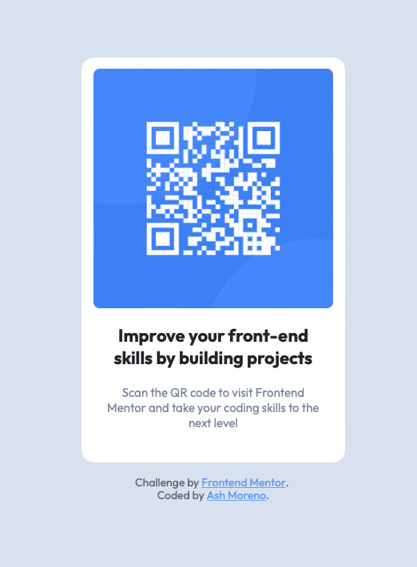

# Frontend Mentor - QR code component

This is a solution to the [QR code component challenge on Frontend Mentor](https://www.frontendmentor.io/challenges/qr-code-component-iux_sIO_H).
Frontend Mentor challenges help you improve your coding skills by building realistic projects.

## Table of contents

- [Overview](#overview)
  - [Screenshot](#screenshot)
  - [Links](#links)
- [My process](#my-process)
  - [Built with](#built-with)
  - [What I learned](#what-i-learned)
- [Author](#author)

### Screenshot

### Link

- Live Site URL: [Netlify](https://qr-code-ashmoreno.netlify.app)

## My process

### Built with

- Semantic HTML5 markup
- CSS custom properties
- Bootstrap

### What I learned

Sometimes I get really nervous writing code for no apparent reason!
I felt the same way here but doing a step by step procedure on how I want to tackle the project helps a lot for me.
By breaking down the project into smaller steps, it got easier for me and I felt less overwhelmed.

## Author

- Website - [Ash Moreno](https://www.ashmoreno.dev)
- Frontend Mentor - [@AshM10](https://www.frontendmentor.io/profile/AshM10)
- Twitter - [@sexy_gravy](https://twitter.com/sexy_gravy)
